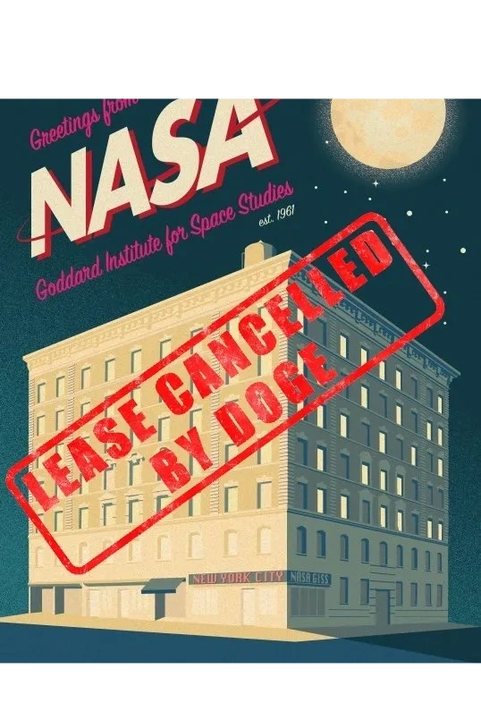

  

## NEWS

+ [Trump administration cancels top NASA climate lab’s lease at Columbia University](https://www.cnn.com/2025/04/24/climate/nasa-lease-canceled-columbia) — CNN

+ [This iconic NASA office changed climate science forever. DOGE plans to kill it](https://www.fastcompany.com/91333946/this-iconic-nasa-office-changed-climate-science-forever-doge-plans-to-kill-it) — Fast Company

+ [NASA office above ‘Seinfeld’ diner is a target of Trump budget shrinkage](https://www.nytimes.com/2025/05/16/nyregion/nasa-office-columbia-seinfeld-toms-restaurant.html?smid=nytcore-ios-share&referringSource=articleShare) — New York Times

+ [ Trump administration set to shutter iconic research center in New York](https://www.axios.com/2025/05/17/trump-nasa-goddard-office) — Axios

+ [ IFPTE urges lawmakers to stop NASA from moving Goddard Institute for Space Studies out of their offices](https://www.ifpte.org/news/ifpte-urges-lawmakers-to-stop-nasa-from-moving-goddard-institute-for-space-studies-out-of-their-offices) — International Federation of Professional & Technical Engineers

+ ['This is an attack on NASA.' Space agency's largest union speaks out as DOGE cuts shutter science institute located above 'Seinfeld' diner in NYC](https://www.space.com/space-exploration/this-is-an-attack-on-nasa-space-agencys-largest-union-speaks-out-as-doge-cuts-shutter-science-institute-located-above-seinfeld-diner-in-nyc) — Space.com

+ [Why is NASA shuttering this iconic institute in New York City?](https://www.scientificamerican.com/article/nasas-goddard-institute-for-space-studies-faces-eviction-under-trump-plan/) — Scientific American

+ [Godfather of climate science decries Trump plan to shut NASA lab above Seinfeld diner: ‘It’s crazy’](https://www.theguardian.com/environment/2025/may/21/nasa-giss-lab-trump-shut-down-james-hansen) — Guardian

